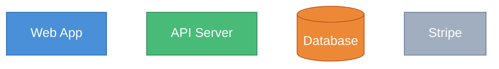
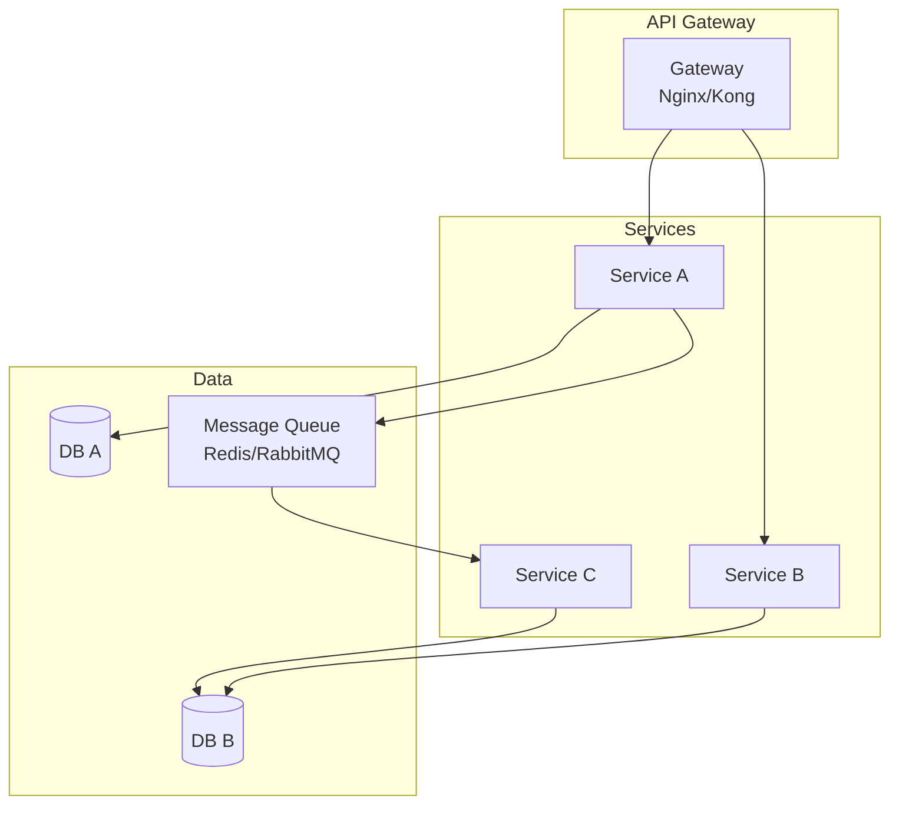
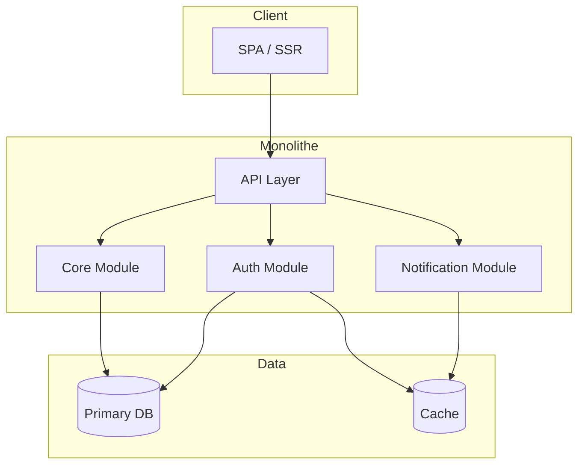
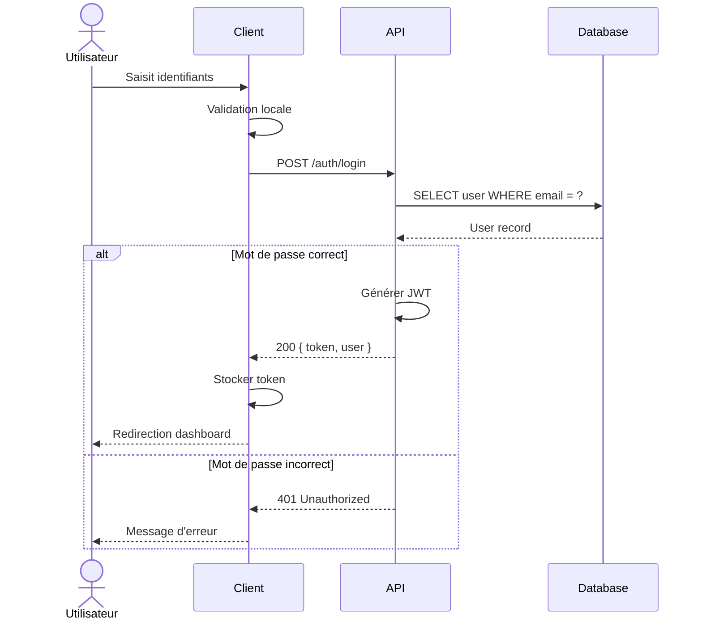

# Référence Mermaid — Syntaxe et pièges courants

Guide pour éviter les erreurs de compilation Mermaid les plus fréquentes.

---

## Erreurs de syntaxe fréquentes

### 1. Caractères spéciaux dans les labels

```mermaid
%% ❌ ERREUR — les parenthèses et crochets cassent le parsing
graph TB
  A[User (admin)] --> B

%% ✅ CORRECT — échapper avec des guillemets
graph TB
  A["User (admin)"] --> B
```

**Caractères à toujours mettre entre guillemets :**
- Parenthèses `( )`
- Crochets `[ ]`
- Accolades `{ }`
- Pipe `|`
- Arobase `@`
- Dièse `#`

### 2. Espaces dans les identifiants

```mermaid
%% ❌ ERREUR — pas d'espace dans les identifiants
graph TB
  User Service --> Database

%% ✅ CORRECT — underscore ou camelCase pour l'ID, guillemets pour le label
graph TB
  UserService["User Service"] --> Database
```

### 3. Flèches dans les diagrammes de séquence

```mermaid
%% ❌ ERREUR — mauvais type de flèche
sequenceDiagram
  A -> B: message

%% ✅ CORRECT
sequenceDiagram
  A->>B: message synchrone
  B-->>A: réponse
  A-)B: message asynchrone
```

| Flèche | Signification |
|--------|---------------|
| `->>` | Appel synchrone (ligne pleine, pointe pleine) |
| `-->>` | Réponse (ligne pointillée, pointe pleine) |
| `-)` | Appel asynchrone (ligne pleine, pointe ouverte) |
| `--)` | Réponse asynchrone (ligne pointillée, pointe ouverte) |

### 4. ERD — syntaxe des relations

```mermaid
%% ❌ ERREUR — label de relation mal placé
erDiagram
  USER ||--o{ ORDER "passe"

%% ✅ CORRECT — label après les deux-points
erDiagram
  USER ||--o{ ORDER : "passe"
```

**Cardinalités :**
```
||--||   exactement un à exactement un
||--o|   exactement un à zéro ou un
||--o{   exactement un à zéro ou plusieurs
||--|{   exactement un à un ou plusieurs
}o--o{   zéro ou plusieurs à zéro ou plusieurs
```

### 5. Class diagram — types avec génériques

```mermaid
%% ❌ ERREUR — les < > cassent le HTML
classDiagram
  class Service {
    +find() Promise<User[]>
  }

%% ✅ CORRECT — utiliser ~ ~ pour les génériques
classDiagram
  class Service {
    +find() Promise~User[]~
  }
```

### 6. Subgraph — guillemets pour les labels avec espaces

```mermaid
%% ❌ ERREUR — espace sans guillemets
graph TB
  subgraph External Services
    A[Stripe]
  end

%% ✅ CORRECT
graph TB
  subgraph "External Services"
    A[Stripe]
  end
```

---

## Bonnes pratiques de lisibilité

### Orientation

| Orientation | Quand l'utiliser |
|-------------|------------------|
| `graph TB` (top→bottom) | Architecture, flux verticaux |
| `graph LR` (left→right) | Séquences, timelines, pipelines |
| `graph RL` (right→left) | Rarement — éviter |
| `graph BT` (bottom→top) | Rarement — hiérarchies inversées |

### Taille des diagrammes

| Type | Max nœuds | Au-delà → |
|------|-----------|-----------|
| Architecture | 20 | Splitter par sous-système |
| Classes | 10 | Splitter par module |
| MCD/ERD | 15 | Splitter par domaine métier |
| Séquence | 7 participants | Simplifier les intermédiaires |
| Cas d'utilisation | 12 use cases | Splitter par acteur |

### Styling



---

## Templates rapides

### Architecture micro-services



### Architecture monolithe modulaire



### Séquence d'authentification (template générique)


