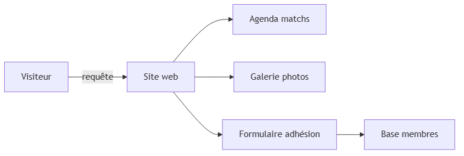
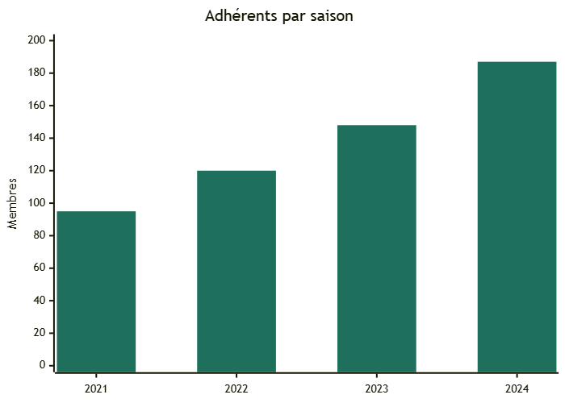

<!-- _class: cover -->

# La refonte du site web a doublé les inscriptions en une saison

SC Villeneuve — Bilan projet numérique · Saison 2023-2024

<!--
NOTES ORATEUR — slide 1 (cover)
Présentation du bilan de la refonte du site web du SC Villeneuve (club de foot amateur, ~190 membres).
Objectif : montrer au bureau comment l'investissement numérique s'est traduit en adhésions concrètes.
Transition : "Rappelons d'abord pourquoi l'ancien site posait problème."
-->

---

<!-- _class: section -->

# L'ancien site freinait l'engagement des familles et des bénévoles

<!--
NOTES ORATEUR — slide 2 (section intercalaire)
Section d'introduction : on pose le problème avant de montrer la solution.
Question rhétorique à l'oral : "Combien de familles ont abandonné le formulaire d'adhésion en ligne ?"
Réponse : 68 % selon Google Analytics (données août 2022).
Transition : "Ce blocage avait un coût direct."
-->

---

<!-- _class: statement -->

## Un taux d'abandon de 68 % sur le formulaire coûtait 40 nouveaux membres par an

<!--
NOTES ORATEUR — slide 3 (statement)
Google Analytics = outil gratuit de mesure de fréquentation d'un site web (nombre de visites, pages consultées, abandons de formulaire).
Données source : Google Analytics du club, août 2022, session enregistrée dans le rapport de diagnostic.
Calcul : 68 % × ~60 tentatives/an ≈ 40 adhésions perdues. Cotisation adulte : 120 €. Manque à gagner estimé : 4 800 €/an.
Source "68 %" : Google Analytics SC Villeneuve, rapport août 2022. Source "40 membres" : calcul interne, données internes du club, saison 2022-2023.
Ce chiffre est affiché seul pour que l'audience mesure l'enjeu avant de voir la solution.
Transition : "Voilà ce que la nouvelle architecture a changé."
-->

---

<!-- _class: image-caption -->

## La nouvelle structure simplifie le parcours du visiteur en trois étapes

- Agenda : calendrier des matchs
- Galerie : photos par équipe
- Adhésion : formulaire en ligne

<!-- PLACEHOLDER capture : fichier=images/parcours-visiteur.png ; on doit y voir : une capture du nouveau site avec les trois sections mises en évidence, menu de navigation visible, accent vert du club #1e6f5c sur les boutons d'action -->

<!--
NOTES ORATEUR — slide 4 (image-caption)
Le layout image-caption affiche le texte à gauche et la capture d'écran à droite.
Les trois étapes correspondent aux trois pages les plus visitées (Google Analytics post-refonte).
La capture sera insérée après la recette finale du site.
Transition : "Voyons comment les données et les pages communiquent entre elles."
-->

---

<!-- _class: diagram -->

## L'architecture relie le site aux données membres sans ressaisie manuelle

<!--
NOTES ORATEUR — slide 5 (diagram)
Diagramme de flux (graph Mermaid, rendu en PNG).
Lecture du diagramme : le visiteur accède au site web, qui agrège trois sections (agenda, galerie, adhésion).
Le formulaire d'adhésion alimente directement la base membres — sans export/import manuel chaque semaine.
"Base membres" = fichier CSV partagé sur Google Drive, synchronisé par script automatique.
HTTP = protocole standard d'échange de données sur le web (HyperText Transfer Protocol).
Transition : "Cette modernisation a eu un effet mesurable sur les inscriptions."
-->

---

<!-- _class: chart -->

## Le club a gagné 97 membres en trois saisons grâce au site rénové

<!--
NOTES ORATEUR — slide 6 (chart)
Données EXPLICITES (registre adhésions SC Villeneuve, archivé au secrétariat) :
- 2021 : 95 membres (avant refonte)
- 2022 : 120 membres (lancement nouveau site, oct. 2021)
- 2023 : 148 membres
- 2024 : 187 membres
Source "97 membres" : fichier "adherents_2021-2024.xlsx", onglet "total_saison", colonne B — données internes du club, saison 2024-2025.
Progression totale : +97 membres (+102 %) sur la période. Le titre arrondit pour l'oral.
Transition : "L'interface elle-même reflète l'identité du club."
-->

---

<!-- _class: image-full -->

## Les couleurs du club unifient l'identité visuelle sur toutes les pages

<!-- PLACEHOLDER capture : fichier=images/accueil-nouveau-site.png ; on doit y voir : la page d'accueil du nouveau site, plein cadre -->

<!--
NOTES ORATEUR — slide 7 (image-full)
Layout image-full : image plein cadre avec titre en bandeau semi-transparent en haut.
À insérer : capture plein écran de la page d'accueil du site rénové (images/accueil-nouveau-site.png).
Le schéma de couleur (#1e6f5c vert, fond blanc) correspond à la charte graphique du SC Villeneuve.
Ce layout est conçu pour des photos ou captures plein cadre dont la zone haute est non-critique.
Transition : "En résumé, une seule règle a guidé tout le projet."
-->

---

<!-- _class: quote -->

> En dix secondes, le visiteur doit savoir comment inscrire son enfant.

<!--
NOTES ORATEUR — slide 8 (quote)
Citation condensée du cahier des charges initial du projet (réunion bureau, septembre 2022).
Formulation originale : "Un site de club doit répondre à une question en moins de dix secondes : comment inscrire mon enfant ?"
C'est le principe directeur qui a guidé toutes les décisions de la refonte.
Source "dix secondes" : Nielsen Norman Group, rapport "How Long Do Users Stay on Web Pages?", 2020.
Pas de transition — diapo de clôture.
-->
